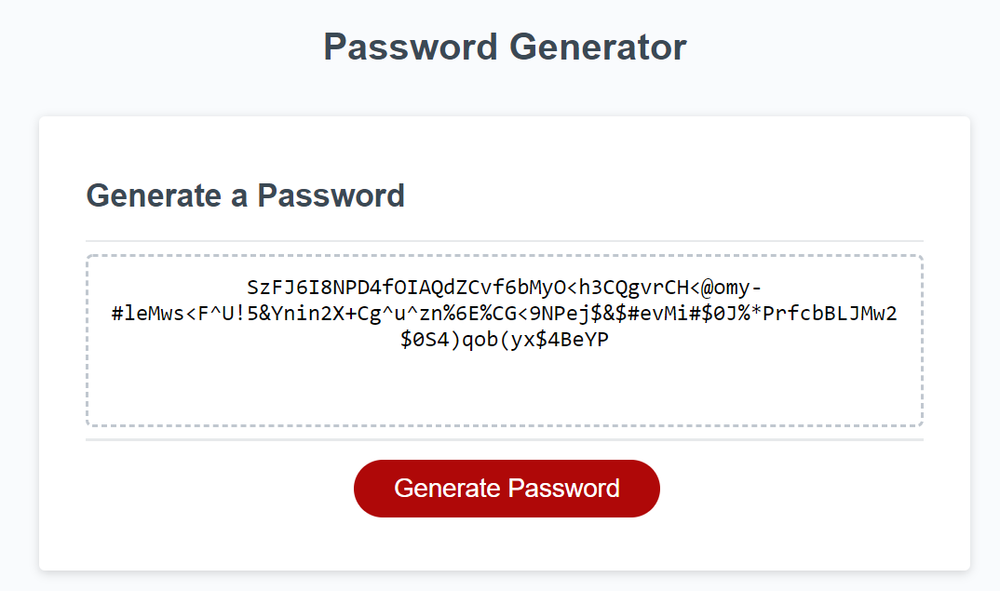

# Code-Refactor
Homework Week 3 - Password Generator 
Author: Foti Mougos 
Deployed At:

### Brief:
The customer would like a secure password to be generated when a 'Generate Password' button is clicked. They would like to be prompted for input criteria (as opposed to using a defined standard or ... y'know, form). These criteria include:

  * Length (8 - 128 characters)
  * Character Types (Lower, Upper, Number, Symbol) (at least one should be selected per customer requirements, is this 1994? all should be selected!!)
  * Password should be displayed on the page

All input should be validated.

Considerations should be made about responsiveness to window scaling & standard sensible styling (make pretty)

Some wise words: "First, solve the problem. Then, write the code."

### Website Demo
Click the "Generate Password" button, you will be asked a series of questions, password length and which characters you would like to include. This program supports uppercase & lowercase letters, numbers and common symbols. 

### Lessons Learned:

  * There are better ways to get input than prompt()/confirm() boxes
  * Github takes a few minutes to display changes when you publish a page
  * Title element is important to add
  * Different platforms/systems will have constraints on what symbols they can and cant use (for parsing/database usecases) its probably best to scope this.
  * Learned how to add images to markdown.
  * Error handling at all costs is important. If any combination of actions your user takes can cause an error (i.e. a password that does not contain any upper,lower,number or symbols) then you should code defensively against it.
  * On that same notion, your program should be held to certain defined standards. All passwords should at least be 8 characters long, so the system will default to this if a number below is provided. Similarly, the system will shorten to 128 if this number is exceeded.
  * Similarly invalid input should be handled. We have defined bounds and this process is not destructive, so there is no issue "rolling with the punches" if invalid/out of bounds input is detected.
  * Just because you -can- do something in one line doesn't mean you -should- (except ternary for true/false cause thats just a no brainer right?)